# xenho-cover

一个给 AI Agent 使用的封面提示词生成 Skill。

把一篇文章、一个主题、一条小红书笔记或一篇公众号推文，变成一份**可直接贴到即梦 / Midjourney / nano banana 的完整图像生成提示词**。风格来自自建风格库——13 个互不重叠的风格原子，从安静的研究报告到先锋剪贴海报，各自有明确的适用边界。

本 Skill **只产提示词，不直接出图**。提示词是自包含的：填实了色值、构图、字体、文字白名单和终检标准，复制粘贴即可用。

## 安装

在 Claude Code 里执行：

```
把 https://github.com/PPory/xenho-cover 安装为我的 skill
```

或手动克隆后建立链接（Windows）：

```powershell
git clone https://github.com/PPory/xenho-cover.git
New-Item -ItemType Junction -Path C:/Users/<你的用户名>/.claude/skills/xenho-cover -Target <克隆路径>
```

macOS / Linux：

```bash
git clone https://github.com/PPory/xenho-cover.git
ln -s <克隆路径> ~/.claude/skills/xenho-cover
```

安装后在任意会话说「给这篇文章配个封面」即可触发。

## 包含的 Skill

| Skill | 用途 |
| --- | --- |
| `xenho-cover` | 把文章 / 主题编译成封面图像提示词，13 个风格原子任选其一 |

## 用法

### 基础：贴一篇文章

```
给这篇文章配个封面：<粘贴全文>，公众号
```

Skill 会提炼标题三层、视觉隐喻、情绪和禁用元素，推荐 3 个候选风格，确认后编译出完整提示词。

### 指定风格

```
用 anthropic-research 风格给这篇文章配个公众号封面
```

点名风格时跳过推荐环节，直接编译。

### 指定平台与比例

```
小红书封面，polish-grain-collage 风格，主题：专注是一种反抗
```

平台与比例映射：小红书 `3:4`、公众号 `2.35:1`、X `5:2`，也可以直接给自定义比例。**没给平台也没给比例时，Skill 会先停下来问**——比例错了整张图作废。

### 要英文提示词

```
用 film-poster-icon 风格配个封面，输出英文提示词，我要贴 Midjourney
```

## 风格库

| 风格 | Style ID | 适用 |
| --- | --- | --- |
| Anthropic Research 风格 | `anthropic-research` | AI、技术、方法论、观点、研究类内容；抽象概念的隐喻转译 |
| Notion 手绘信息图 | `notion-doodle` | 教程、步骤、干货清单、对比评测；松弛亲和、降低阅读门槛 |
| 波兰颗粒剪贴海报 | `polish-grain-collage` | 文化议题、冲突感观点、活动预告；视觉音量最大 |
| 瑞士网格手写对撞 | `swiss-grid-scrawl` | 创作、写作、设计、思考过程；「秩序 vs 失控」的张力 |
| 赛博工业面板 | `cyber-industrial-panel` | AI 工具、系统架构、工作流、硬核技术文；冷静的未来感 |
| 商业杂志头版 | `business-magazine-front-page` | 商业趋势、公司产品分析、投资创业；媒体权威感 |
| 黑白字体样张 | `bw-type-specimen` | 宣言、金句、概念提出、文字出版元话题；纯排版 |
| 撕纸摄影拼贴 | `torn-photo-collage` | 情绪浓度高的叙事文、个人经历、反精致观点 |
| 脏打字机样张 | `dirty-typewriter-specimen` | 宣言、态度文、复古粗粝的暗色标题主导封面 |
| 复古半调波普 | `retro-halftone-pop` | 第一人称态度文、情绪话题；主体可以是人、物或一组东西 |
| 荧光档案打字机 | `highlight-archive-type` | 轻快干货、观点表态、文书档案感；库内最轻快的风格 |
| 电影感摄影排版 | `cinematic-photo-editorial` | 氛围叙事、场景体验、大片感；满幅单色调电影摄影 |
| 概念物电影海报 | `film-poster-icon` | 单一强意象、隆重文学感；「人在结构面前很小」这类母题 |

## 风格示例

以下封面全部由本 Skill 产出的提示词生成，比例为公众号头图 `2.35:1`。

### Anthropic Research 风格 · `anthropic-research`

纯色底 + 衬线大标题 + 大型有机色块承载的抽象隐喻线稿。气质克制、理性、安静，像一家顶级研究机构发布的一页视觉报告。四套底色方案可选。

| 陶土橙方案 | 深黑方案 |
| --- | --- |
| 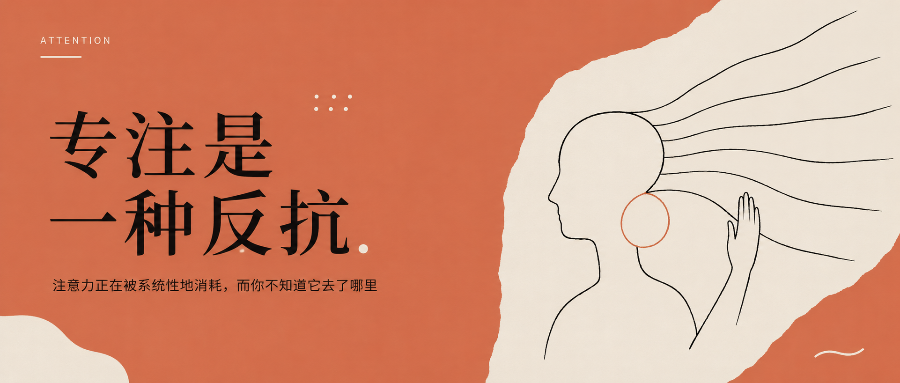 | 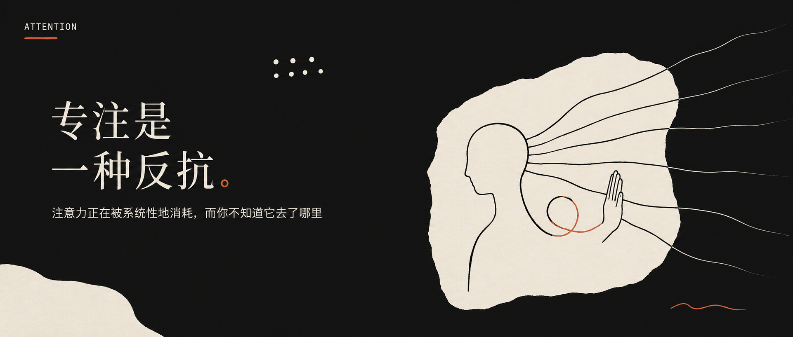 |

### Notion 手绘信息图 · `notion-doodle`

极简手势感的黑白墨线，像聪明人随手画在纸上的思考笔记。五种构图型（场景 / 流程 / 要点 / 对比 / 时间线）按内容选。

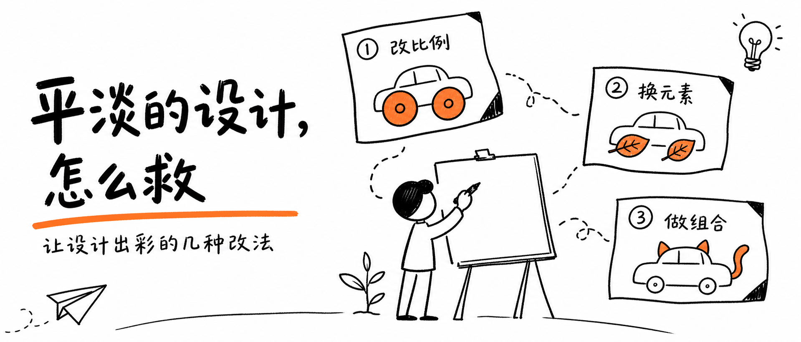

### 波兰颗粒剪贴海报 · `polish-grain-collage`

标题逐字散落，与颗粒肌理的有机形块在炭黑舞台上做正负形游戏，一块朱红剪影压住全场。

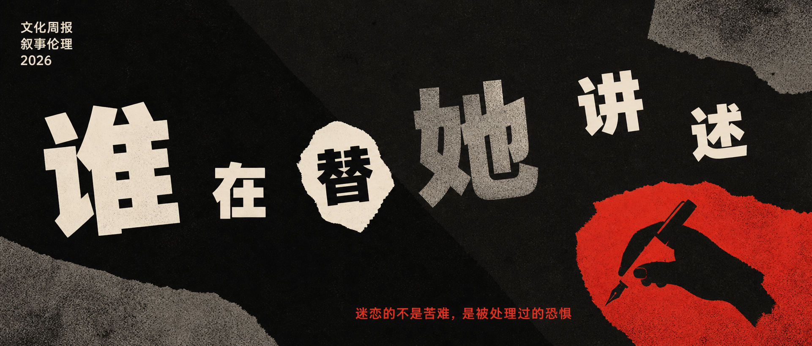

### 瑞士网格手写对撞 · `swiss-grid-scrawl`

严谨的瑞士网格印刷品浮在写满激动手迹的桌面上，一张高亮黄卡片上是标题关键词的失控手写形态。同一个词的两种人格。

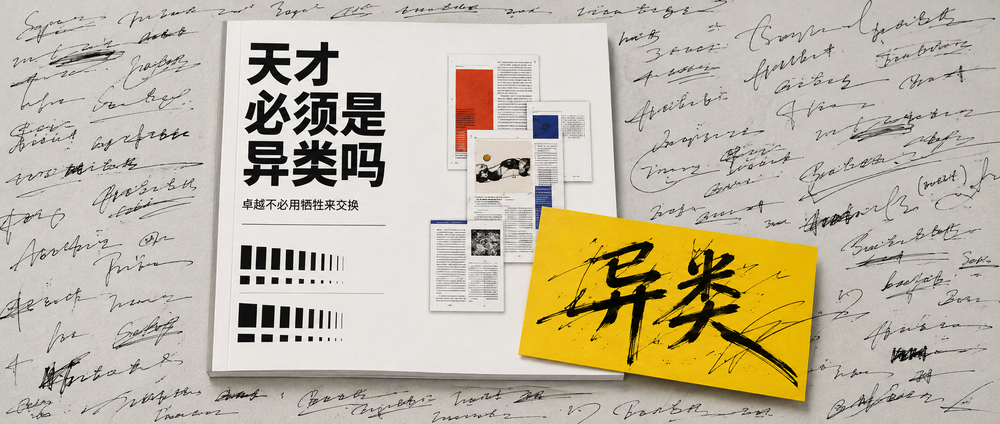

### 赛博工业面板 · `cyber-industrial-panel`

纯黑打底，多档黑度的装甲面板以 45° 折角互相咬合，浅灰走线在黑暗里画出结构。哑光单色，是工业图纸的未来感而非霓虹赛博朋克。

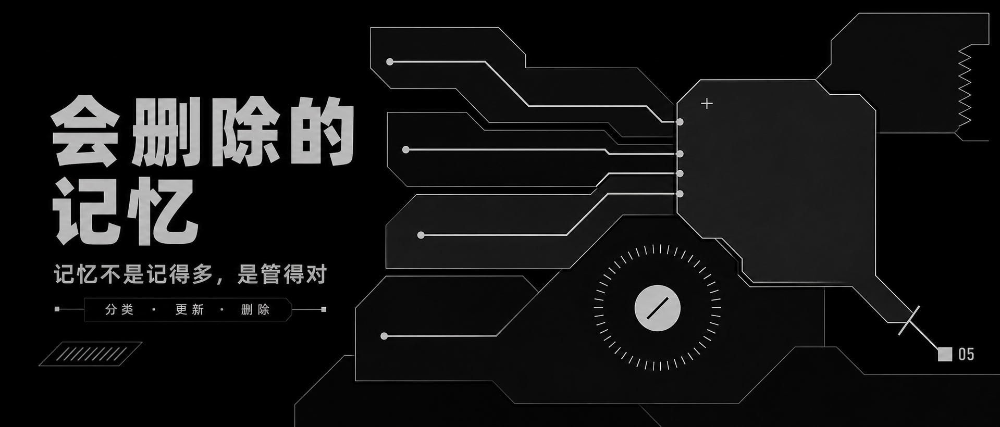

### 商业杂志头版 · `business-magazine-front-page`

锐利标题、编辑栏、强商业隐喻。标题必须与隐喻图形融合重构，封面本身就是一句商业判断。

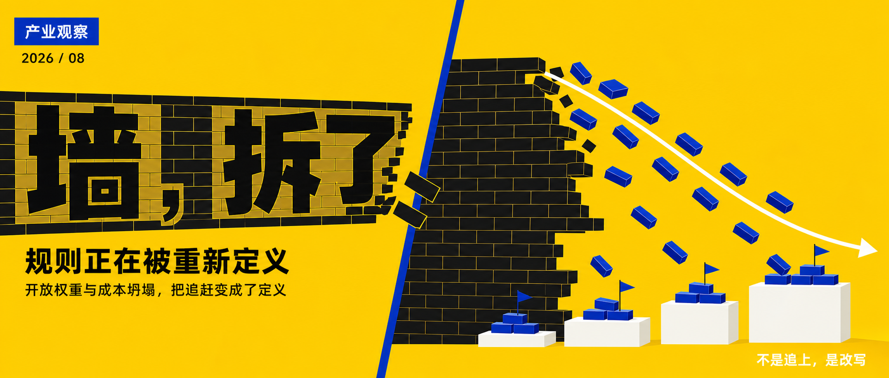

### 黑白字体样张 · `bw-type-specimen`

字体本身是唯一的图形素材。巨型衬线字在黑白正负空间里出血、叠压、跨区反色，配小字规格注脚。

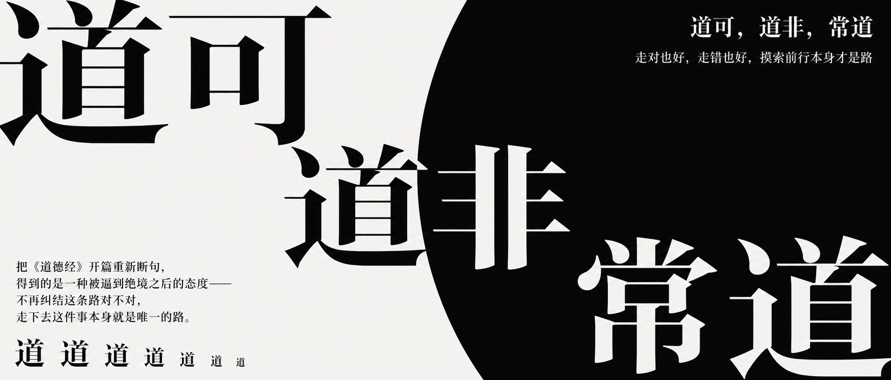

### 撕纸摄影拼贴 · `torn-photo-collage`

黑白纪实摄影被撕裂重组，深红色块压场，牛皮纸与印刷残片层层贴叠。三层面积必须均衡——这是拼贴板，不是一张照片加边饰。

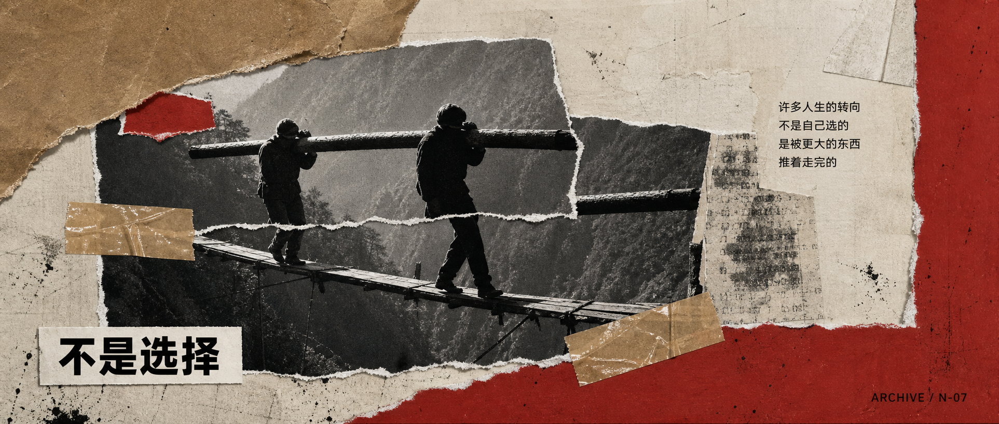

### 脏打字机样张 · `dirty-typewriter-specimen`

炭黑粗纸上印着磨损的粗衬线巨字，像一枚盖歪了的橡皮图章；旁边一张高对比黑白的机械物件照片，底部一行规格标签收住版式。

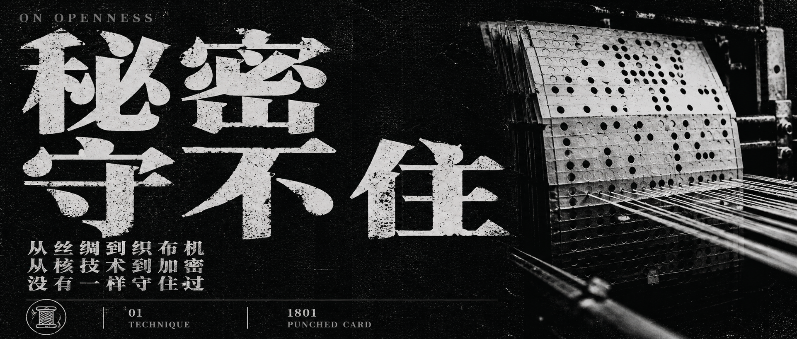

### 复古半调波普 · `retro-halftone-pop`

动画线稿插画被一整层粗到能数出单点的 CMYK 半调网点压过去，高饱和三色硬碰硬。主体形态自由——人物特写、物件特写或 2–3 个元素的组合都行。

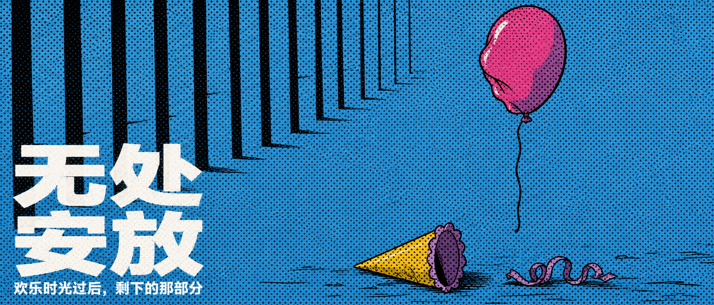

### 荧光档案打字机 · `highlight-archive-type`

冷灰纸底上，黑色打字机粗字被荧光绿记号笔整行划过；右下角一件半调网点化的物件像剪报里贴上去的插图。

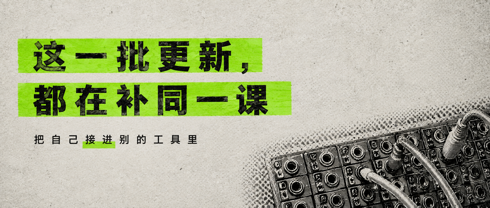

### 概念物电影海报 · `film-poster-icon`

饱和实色底上立着一个巨大的概念物剪影，一个小到看不清脸的人站在它脚下。尺度对比是核心修辞，配电影海报的三段式排版层级。

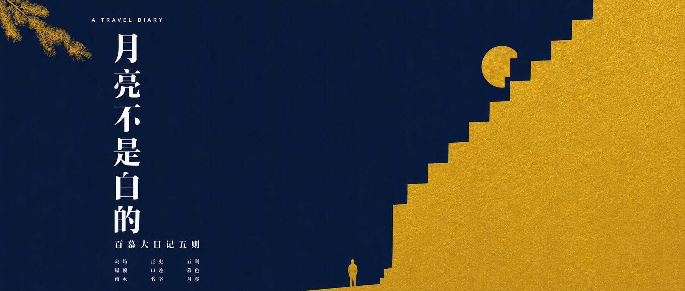

### 电影感摄影排版 · `cinematic-photo-editorial`

满幅出血的单色调实拍摄影，巨型紧缩标题长在景深里，上缘编辑标签与底部虚构徽章把它钉成一件正式发行物。三套色调方案：深海蓝 / 暮金琥珀 / 暗林绿。

> 示例图待补。

## 目录结构

```
xenho-cover/
├── SKILL.md                    # skill 入口：工作流 + 门控 + Gotchas
├── references/
│   ├── cover-prompt-blueprint.md   # 最终提示词的结构（封面形状）
│   └── style-catalog.md            # 风格菜单、内容匹配、平台推荐
├── styles/{style-id}/
│   ├── META.md                 # 结构化锚点（色板、构图适配、必守项、禁用项）
│   └── STYLE.md                # 视觉语言的完整描述
└── example-image/              # 各风格的实际产出示例
```

设计上风格库与工作流分离：**加新风格只需要加一个 `styles/{id}/` 文件夹，不用改 `SKILL.md`**。

## 设计要点

几条从实际出图里打磨出来的规则，也是这个 Skill 和「直接让模型写提示词」的区别：

- **编译而非拼接**——最终提示词不是「封面指令 + 风格原文」两段并排，风格锚点必须被改写融合进封面形状，成品里认不出原文段落才算合格。
- **文字白名单**——穷举画面内允许出现的每一个字，没有指定内容的文字槽位必须标注为「不可辨读的占位质感」。空槽必然被图像模型自行填字。
- **字效安全距离**——标题与图形融合时，破坏 / 遮挡效果与任何笔画保持至少一个字宽的缓冲，破坏只发生在字的周边。
- **汉字正确性**——图像模型写错中文是最高频翻车点，每份提示词都有硬性要求。
- **隐喻禁直译**——AI 不画机器人，网页不画电脑，效率不画时钟齿轮。
- **不画品牌**——风格原作方的名称不入画；文章自带的公司名、产品名、真实人名也一律不入画，标题需去品牌化改写。

## 加新风格

1. 收集参考图放进 `refs/{style-id}/`
2. **先看参考图再动笔**写 `META.md` 和 `STYLE.md`——凭印象写规则是本项目已发生过的翻车来源
3. 在 `references/style-catalog.md` 的风格表加一行，更新「内容 → 风格匹配」和平台推荐
4. 跑几篇真实文章出图验证，再回头校准规则

## 致谢

架构参考 [adrianpunk/Punk-Skill](https://github.com/adrianpunk/Punk-Skill) 的 punk-cover。

风格原子的视觉语言分别取法于 Anthropic Research 的视觉报告、Notion 官方插画（Roman Muradov 一系）、波兰海报学派、瑞士平面设计范式、NKH Studio 的工业平面语言、Scott Clum / Ray Gun 的编辑拼贴，以及华语与国际艺术电影海报。本项目只借鉴视觉语言，不使用任何原作方的名称、标识或商标——所有风格原子的禁用清单里都明确写了这一条。

## License

MIT
