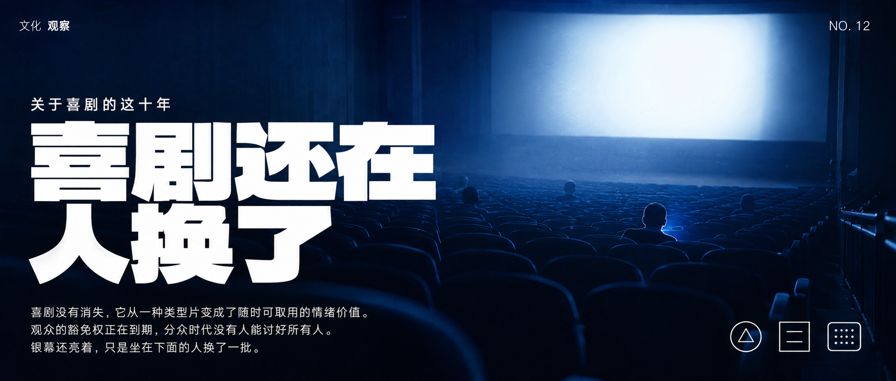

# xenho-cover

一个给 AI Agent 使用的封面提示词生成 Skill。

把一篇文章、一个主题、一条小红书笔记或一篇公众号推文，变成一份**可直接贴到即梦 / Midjourney / nano banana 的完整图像生成提示词**。风格来自自建风格库——13 个互不重叠的风格原子，从安静的研究报告到先锋剪贴海报，各自有明确的适用边界。

本 Skill **只产提示词，不直接出图**。提示词是自包含的：填实了色值、构图、字体、文字白名单和终检标准，复制粘贴即可用。

## 安装

在 Claude Code 里执行：

```
把 https://github.com/PPory/xenho-cover 安装为我的 skill
```

或手动克隆后建立链接（Windows）：

```powershell
git clone https://github.com/PPory/xenho-cover.git
New-Item -ItemType Junction -Path C:/Users/<你的用户名>/.claude/skills/xenho-cover -Target <克隆路径>
```

macOS / Linux：

```bash
git clone https://github.com/PPory/xenho-cover.git
ln -s <克隆路径> ~/.claude/skills/xenho-cover
```

安装后在任意会话说「给这篇文章配个封面」即可触发。

## 包含的 Skill

| Skill | 用途 |
| --- | --- |
| `xenho-cover` | 把文章 / 主题编译成封面图像提示词，13 个风格原子任选其一 |

## 用法

### 基础：贴一篇文章

```
给这篇文章配个封面：<粘贴全文>，公众号
```

Skill 会提炼标题三层、视觉隐喻、情绪和禁用元素，推荐 3 个候选风格，确认后编译出完整提示词。

### 指定风格

```
用 anthropic-research 风格给这篇文章配个公众号封面
```

点名风格时跳过推荐环节，直接编译。

### 指定平台与比例

```
小红书封面，polish-grain-collage 风格，主题：专注是一种反抗
```

平台与比例映射：小红书 `3:4`、公众号 `2.35:1`、X `5:2`，也可以直接给自定义比例。**没给平台也没给比例时，Skill 会先停下来问**——比例错了整张图作废。

### 要英文提示词

```
用 film-poster-icon 风格配个封面，输出英文提示词，我要贴 Midjourney
```

## 风格库

| 风格 | Style ID | 视觉语言 | 适用 |
| --- | --- | --- | --- |
| Anthropic Research 风格 | `anthropic-research` | 纯色底 + 衬线大标题 + 有机色块承载的抽象隐喻线稿 | AI、技术、方法论、观点、研究类内容；抽象概念的隐喻转译 |
| Notion 手绘信息图 | `notion-doodle` | 纸白底 + 马克笔黑白墨线 + 五种构图型的信息图 | 教程、步骤、干货清单、对比评测；松弛亲和、降低阅读门槛 |
| 波兰颗粒剪贴海报 | `polish-grain-collage` | 炭黑底 + 逐字散落的标题 + 颗粒肌理形块 + 一块朱红 | 文化议题、冲突感观点、活动预告；视觉音量最大 |
| 瑞士网格手写对撞 | `swiss-grid-scrawl` | 瑞士网格印刷品浮在满纸手迹上 + 高亮黄卡片 | 创作、写作、设计、思考过程；「秩序 vs 失控」的张力 |
| 赛博工业面板 | `cyber-industrial-panel` | 纯黑装甲面板 45° 咬合 + 浅灰走线 + 放射刻度圆 | AI 工具、系统架构、工作流、硬核技术文；冷静的未来感 |
| 商业杂志头版 | `business-magazine-front-page` | 高饱和撞色 + 锐利标题与商业隐喻融合 + 编辑栏 | 商业趋势、公司产品分析、投资创业；媒体权威感 |
| 黑白字体样张 | `bw-type-specimen` | 纯黑白 + 弧线切分正负空间 + 巨型衬线字跨区反色 | 宣言、金句、概念提出、文字出版元话题；纯排版 |
| 撕纸摄影拼贴 | `torn-photo-collage` | 黑白纪实摄影撕裂重拼 + 深红压场 + 牛皮纸层叠 | 情绪浓度高的叙事文、个人经历、反精致观点 |
| 脏打字机样张 | `dirty-typewriter-specimen` | 炭黑粗纸 + 磨损粗衬线巨字 + 高对比黑白物件照 | 宣言、态度文、复古粗粝的暗色标题主导封面 |
| 复古半调波普 | `retro-halftone-pop` | 动画线稿 + 粗 CMYK 半调网点 + 高饱和三色撞色 | 第一人称态度文、情绪话题；主体可以是人、物或一组东西 |
| 荧光档案打字机 | `highlight-archive-type` | 冷灰纸底 + 打字机粗字 + 整行荧光绿高亮 + 半调物件 | 轻快干货、观点表态、文书档案感；库内最轻快的风格 |
| 电影感摄影排版 | `cinematic-photo-editorial` | 满幅出血单色调实拍 + 巨字长在景深里 + 虚构徽章 | 氛围叙事、场景体验、大片感；题材由文章定，不限场景 |
| 概念物电影海报 | `film-poster-icon` | 饱和实色底 + 巨型概念物剪影 + 微小人影的尺度对比 | 单一强意象、隆重文学感；「人在结构面前很小」这类母题 |

## 风格示例

全部由本 Skill 产出的提示词生成，比例为公众号头图 `2.35:1`。点击图片可看大图。

<table>
<tr>
<td width="33%"><br><b>Anthropic Research · 陶土橙</b><br><code>anthropic-research</code></td>
<td width="33%"><br><b>Anthropic Research · 深黑</b><br><code>anthropic-research</code></td>
<td width="33%"><br><b>Notion 手绘信息图</b><br><code>notion-doodle</code></td>
</tr>
<tr>
<td><br><b>波兰颗粒剪贴海报</b><br><code>polish-grain-collage</code></td>
<td><br><b>瑞士网格手写对撞</b><br><code>swiss-grid-scrawl</code></td>
<td><br><b>赛博工业面板</b><br><code>cyber-industrial-panel</code></td>
</tr>
<tr>
<td><br><b>商业杂志头版</b><br><code>business-magazine-front-page</code></td>
<td><br><b>黑白字体样张</b><br><code>bw-type-specimen</code></td>
<td><br><b>撕纸摄影拼贴</b><br><code>torn-photo-collage</code></td>
</tr>
<tr>
<td><br><b>脏打字机样张</b><br><code>dirty-typewriter-specimen</code></td>
<td><br><b>复古半调波普</b><br><code>retro-halftone-pop</code></td>
<td><br><b>荧光档案打字机</b><br><code>highlight-archive-type</code></td>
</tr>
<tr>
<td><br><b>电影感摄影排版</b><br><code>cinematic-photo-editorial</code></td>
<td><br><b>概念物电影海报</b><br><code>film-poster-icon</code></td>
<td></td>
</tr>
</table>

## 目录结构

```
xenho-cover/
├── SKILL.md                    # skill 入口：工作流 + 门控 + Gotchas
├── references/
│   ├── cover-prompt-blueprint.md   # 最终提示词的结构（封面形状）
│   └── style-catalog.md            # 风格菜单、内容匹配、平台推荐
├── styles/{style-id}/
│   ├── META.md                 # 结构化锚点（色板、构图适配、必守项、禁用项）
│   └── STYLE.md                # 视觉语言的完整描述
└── example-image/              # 各风格的实际产出示例
```

设计上风格库与工作流分离：**加新风格只需要加一个 `styles/{id}/` 文件夹，不用改 `SKILL.md`**。

## 设计要点

几条从实际出图里打磨出来的规则，也是这个 Skill 和「直接让模型写提示词」的区别：

- **编译而非拼接**——最终提示词不是「封面指令 + 风格原文」两段并排，风格锚点必须被改写融合进封面形状，成品里认不出原文段落才算合格。
- **文字白名单**——穷举画面内允许出现的每一个字，没有指定内容的文字槽位必须标注为「不可辨读的占位质感」。空槽必然被图像模型自行填字。
- **字效安全距离**——标题与图形融合时，破坏 / 遮挡效果与任何笔画保持至少一个字宽的缓冲，破坏只发生在字的周边。
- **汉字正确性**——图像模型写错中文是最高频翻车点，每份提示词都有硬性要求。
- **隐喻禁直译**——AI 不画机器人，网页不画电脑，效率不画时钟齿轮。
- **不画品牌**——风格原作方的名称不入画；文章自带的公司名、产品名、真实人名也一律不入画，标题需去品牌化改写。

## 加新风格

1. 收集参考图放进 `refs/{style-id}/`
2. **先看参考图再动笔**写 `META.md` 和 `STYLE.md`。这一步有两种翻车方式，本项目都犯过：
   - **抄不够**：凭印象编出参考图里没有的规则；
   - **抄过头**：把参考图的**题材**当成规则写死（某个风格的参考图恰好是潜水海报，结果「水下」「游鱼」「礁石」进了四处规则，导致什么文章都往水里拍）。
   判据：参考图提供**构图、排版、色彩分级、信息层级、质感**；**题材永远由文章决定**。任何一条规则换个题材就不成立，它就是题材泄漏。
3. 在 `references/style-catalog.md` 的风格表加一行，更新「内容 → 风格匹配」和平台推荐
4. 跑几篇真实文章出图验证，再回头校准规则

## 致谢

风格原子的视觉语言分别取法于 Anthropic Research 的视觉报告、Notion 官方插画（Roman Muradov 一系）、波兰海报学派、瑞士平面设计范式、NKH Studio 的工业平面语言、Scott Clum / Ray Gun 的编辑拼贴，以及华语与国际艺术电影海报。本项目只借鉴视觉语言，不使用任何原作方的名称、标识或商标——所有风格原子的禁用清单里都明确写了这一条。

## License

MIT
